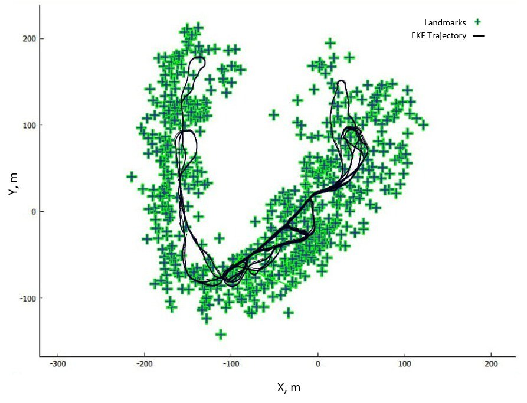
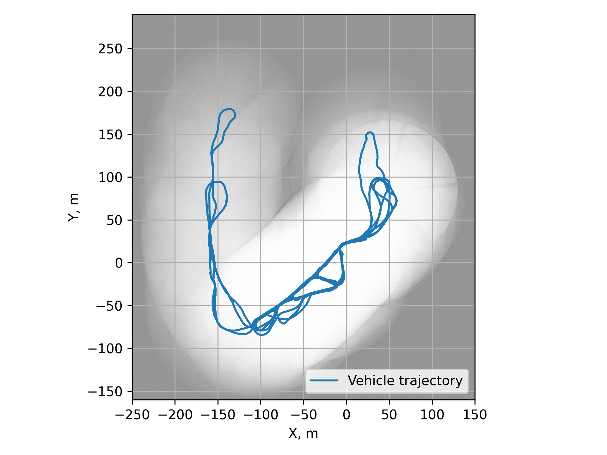
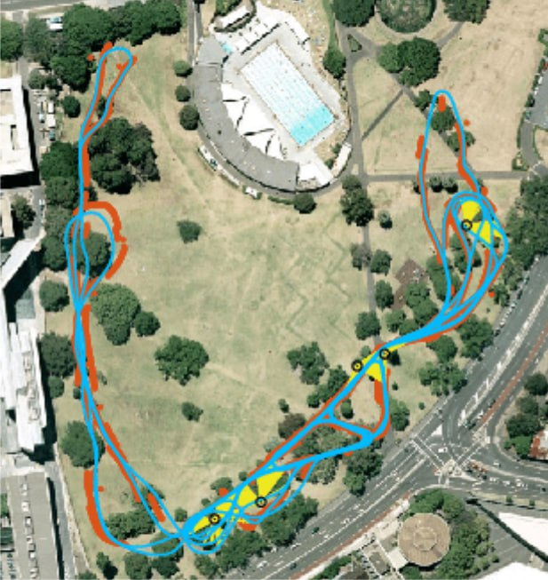

# EKF-SLAM with Occupancy Grid: A Comprehensive Framework for Autonomous Navigation in Complex Environments

This repository provides a complete implementation of **Extended Kalman Filter SLAM (EKF-SLAM)** combined with **Occupancy Grid Mapping (OGM)** using the *Victoria Park Dataset*.  
It integrates GPS, odometry, and LiDAR sensor streams to perform robust localization, landmark association, and environment mapping.

---

## 📌 Key Features

- **Full EKF-SLAM pipeline**  
  Odometry prediction, GPS updates, LiDAR updates, and covariance propagation.

- **Robust Data Association**  
  Matching LiDAR observations to tree landmarks using a Mahalanobis distance cost matrix.

- **Occupancy Grid Mapping**  
  Bayesian log-odds updates to classify free, occupied, and unknown regions.

- **Victoria Park Dataset Integration**  
  Handles asynchronous GPS, LiDAR, and odometry events.

- **Clean Visualizations**  
  - EKF vehicle trajectory  
  - Landmark map  
  - Occupancy grid  
  - Aerial map comparison  

For detailed theory, methodology, and mathematical models, **refer to the full report included in this repository**.

---

## 📂 Project Structure
ekf-slam-perception/
│── EKF-SLAM/
│ ├── data/
│ ├── victoria_park_slam.py
│ ├── slam_utils.py
│ └── tree_extraction.py
│
│── Occupancy-Grid-Mapping/
│ ├── occupancy_grid_map.py
│ ├── data_extract.py
│ └── tools.py
│
│── assets/
│ ├── vp_dataset.jpg
│ ├── ekf_states_lm.jpg
│ └── OGM.png
│
│── EKF-SLAM_Project_Report.pdf
│── README.md


---

## 🖼 Visual Results

### **1. EKF-SLAM Trajectory with Landmarks**


### **2. Occupancy Grid Map**


### **3. Trajectory on Aerial Map (Victoria Park Dataset)**


---

## 🎥 Demo Video

https://github.com/user-attachments/assets/6af19840-7a6c-43e5-8cff-b32521f67566

---

## ▶️ How to Run the Project

### **1. Run EKF-SLAM**

Navigate to the EKF-SLAM folder:

```bash
cd EKF-SLAM
python victoria_park_slam.py
```

This will generate the output file ``` Extracted States & Lidar Data.txt ```. This file contains the EKF trajectory and processed LiDAR points which are required for occupancy grid map generation.

### **2. Occupancy Grid Mapping**

Once the above file is created, navigate to the Occupancy-Grid-Mapping directory:
```bash
cd ../Occupancy-Grid-Mapping
python occupancy_grid_map.py
```

This will produce the occupancy grid map in the folder as ``` OGM.png ```.

## 📘 Project Report

A detailed technical report explaining the methodology, models, data association, EKF pipeline, and occupancy grid mapping is included in ``` EKF-SLAM_Project_Report.pdf ```.

